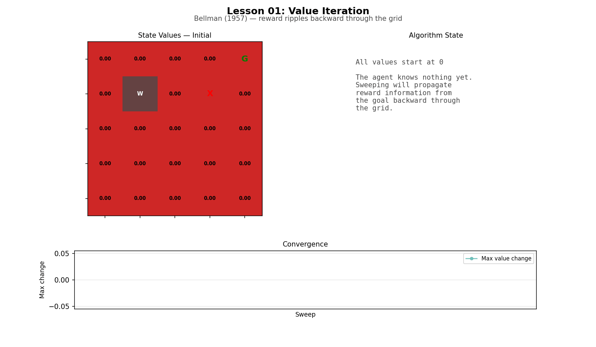
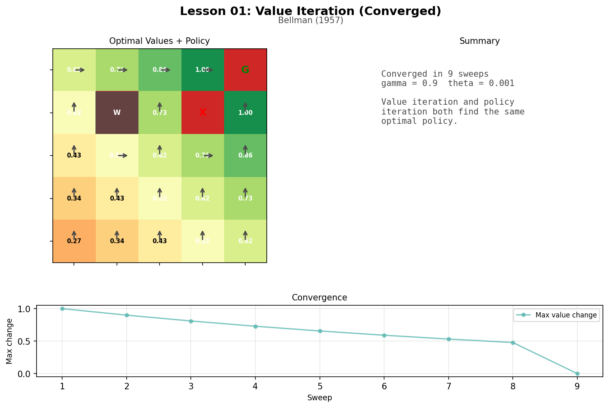
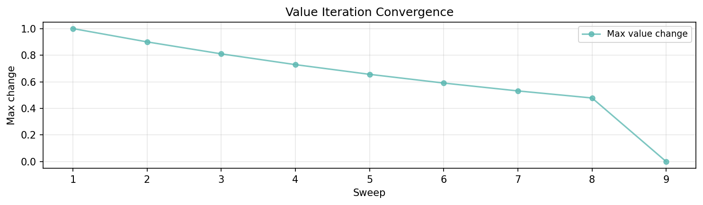

# Lesson 1: The Bellman Equation (Bellman, 1957)

In 1957, Richard Bellman formalized how to make optimal decisions in sequential problems. This lesson implements his two dynamic programming algorithms — value iteration and policy iteration — on a small gridworld, and animates the process of value propagation.

```
uv run python lessons/01_bellman.py
```

## The Gridworld

The agent lives in a 5x5 grid. It can move North, East, South, or West. Hitting a wall or boundary leaves it in place.

```
Layout:
  . . . . G     G = goal (+1 reward, episode ends)
  . # . X .     # = wall (impassable)
  . . . . .     X = pit (-1 reward, episode ends)
  . . . . .     . = empty (-0.04 per step)
  S . . . .     S = start
```

The step cost of -0.04 encourages the agent to reach the goal quickly rather than wandering. The question is: from any cell, what is the best direction to go?

## Value Iteration

Value iteration answers "how good is each state?" by assigning a number to every cell. This number is called V (the value) and it represents how much total future reward the agent can expect from that cell, assuming it plays optimally from there.

At the start, all values are zero — the agent knows nothing. Then it sweeps through every cell, updating each one:

> "Try all four actions. For each action, look at the immediate reward and the value of wherever that action leads. Multiply the future value by gamma (0.9) because one step of distance makes it worth a bit less. Keep the best score."

In math: `V(s) = max over actions of [reward + gamma * V(next state)]`

Here is a concrete example. Consider cell (0,3), directly west of the goal:

```
Move East  -> reach goal, get +1.  Value: +1.0 + 0.9 * 0 = +1.0
Move North -> hit boundary, stay.  Value: -0.04 + 0.9 * 0 = -0.04
Move South -> cell (1,3) is pit.   Value: -1.0 + 0.9 * 0 = -1.0
Move West  -> cell (0,2), empty.   Value: -0.04 + 0.9 * 0 = -0.04

Best action: East. New V(0,3) = +1.0
```

On the first sweep, only cells next to the goal or pit get meaningful values. On the second sweep, their neighbors update. Gradually, information about rewards "ripples" backward through the grid until every cell knows how good it is.

### Convergence

```
Converged in 9 sweeps.

Sweep-by-sweep convergence (max value change):
  Sweep  1:  1.000000  [########################################]
  Sweep  2:  0.900000  [####################################....]
  Sweep  3:  0.810000  [################################........]
  Sweep  4:  0.729000  [#############################...........]
  Sweep  5:  0.656100  [##########################..............]
  Sweep  6:  0.590490  [#######################.................]
  Sweep  7:  0.531441  [#####################...................]
  Sweep  8:  0.478297  [###################.....................]
  Sweep  9:  0.000000  [........................................]
```

With synchronous updates, information travels exactly one cell per sweep — each state reads the previous sweep's values. The max change decays by gamma (0.9) each sweep because each new wavefront cell's change is gamma times the previous one's (the goal reward, discounted one step further). The start cell is 8 steps from the goal, so it takes 8 sweeps for goal information to reach it. Sweep 9 confirms nothing changed — convergence.

### Final State Values

```
+0.621  +0.734  +0.860  +1.000     G
+0.519    ##    +0.734     X    +1.000
+0.427  +0.519  +0.621  +0.734  +0.860
+0.344  +0.427  +0.519  +0.621  +0.734
+0.270  +0.344  +0.427  +0.519  +0.621
```

The highest values are near the goal (top-right). The lowest are at the start (bottom-left), furthest away. Values decrease smoothly with distance — each step away from the goal costs roughly a factor of gamma (0.9).

The start cell has value +0.270. The optimal path is 8 steps long — the +1 goal reward arrives at step 8 and is discounted by gamma^7 (0.9^7 = 0.478), but seven step costs of -0.04 along the way reduce the total further.

### Optimal Policy

```
  >      >      >      >      G
  ^      #      ^      X      ^
  ^      >      ^      >      ^
  ^      ^      ^      ^      ^
  ^      ^      ^      ^      ^
```

Starting at S (bottom-left), follow the arrows: up, up, up, up to the top row, then right, right, right, right to the goal. Eight steps — the shortest path. The wall and pit are naturally avoided because their neighbors have lower values.

## Policy Iteration

Policy iteration takes a different approach. Instead of finding the optimal values directly, it alternates between two steps:

1. **Policy evaluation**: "how good is my current plan?" Compute V(s) for the current policy until stable.
2. **Policy improvement**: "can I do better?" For each state, switch to the best action under the new values.

Repeat until the policy stops changing. Converged in 7 evaluate/improve cycles.

Each cycle includes a full policy evaluation (many inner sweeps until values stabilize under the current policy), so 7 cycles is more total work than it appears.

### Final State Values

```
+0.621  +0.734  +0.860  +1.000     G
+0.519    ##    +0.734     X    +1.000
+0.427  +0.519  +0.621  +0.734  +0.860
+0.344  +0.427  +0.519  +0.621  +0.734
+0.270  +0.344  +0.427  +0.519  +0.621
```

### Optimal Policy

```
  >      >      >      >      G
  ^      #      ^      X      ^
  ^      >      ^      >      ^
  ^      ^      ^      ^      ^
  ^      ^      ^      ^      ^
```

## Comparison

```
Values match:   yes
Policies match: yes
```

Both methods find the same optimal policy. Value iteration took 9 sweeps through the entire state space. Policy iteration took 7 evaluate/improve cycles, each containing many inner sweeps.

They arrive at the same answer because there is only one optimal value function for a given MDP and discount factor. The algorithms search for it differently:

- **Value iteration**: sweep all states, always pick the best action. Fast per sweep, many sweeps.
- **Policy iteration**: fix a policy, fully evaluate it, then improve. Fewer outer cycles, but each cycle does a full evaluation.

The key insight is the same in both: planning is repeated local backup until distant consequences become visible. Each state learns about the goal not by seeing it directly, but by looking one step ahead at a neighbor that already knows. Information propagates through the grid like a wave.

## Artifacts

### Value Propagation Animation



Reward information ripples backward from the goal through the grid, one sweep at a time. Policy arrows appear on the final frames.

### Converged State with Policy Arrows



### Convergence Curve



Max value change per sweep. The change decays by a factor of gamma (0.9) each sweep — each new wavefront cell's update is the goal reward discounted one step further. The values themselves also include step costs, but the *change* between sweeps follows a clean geometric decay.

## Next

Both algorithms found the optimal policy by reasoning about the environment's rules. But what if the agent does not know the rules? In Lesson 02, the Barto/Sutton actor-critic learns to balance a pole through trial and error alone.
