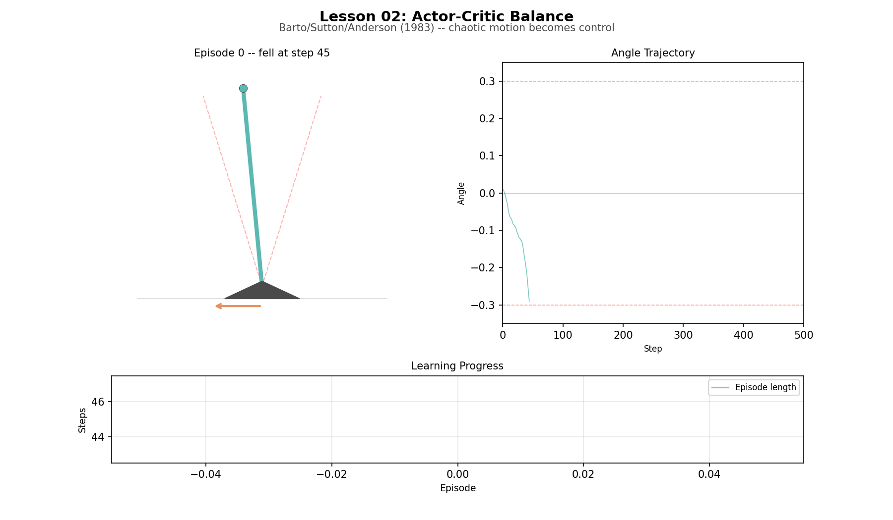
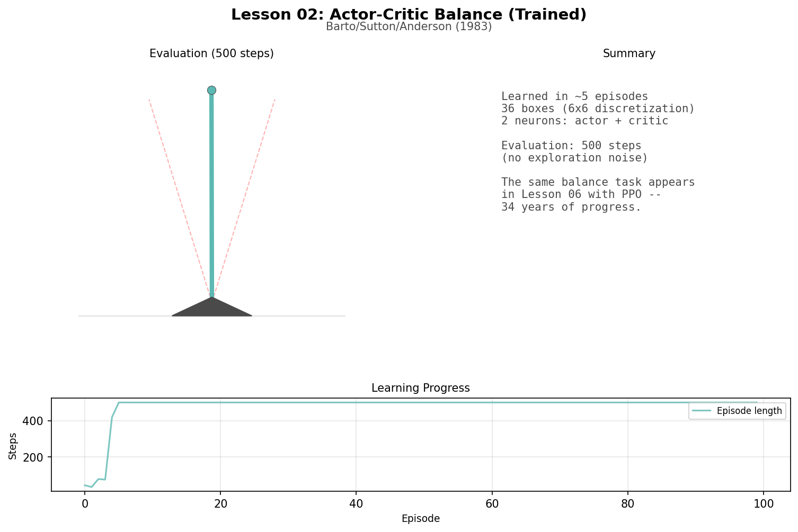
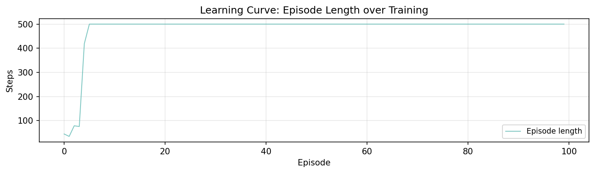

# Lesson 2: The Actor-Critic (Barto, Sutton & Anderson, 1983)

In 1983, Barto, Sutton, and Anderson showed that two simple neurons could learn to balance a pole through trial and error alone. Unlike Lesson 01, the agent has no access to the environment's rules. It must discover good behavior by acting, observing consequences, and adjusting.

```
uv run python lessons/02_barto_sutton.py
```

## From Planning to Learning

In Lesson 01, the agent had a map. Now the map is gone. The agent faces a balance task: keep a pole upright by pushing left or right. It does not know the physics. It only knows whether it succeeded or failed. This is the fundamental shift: from reasoning about a known model to learning from consequences.

## The Balance Task

A pole is hinged at a point. The agent applies left or right torque to keep it upright.

```
State:   (angle, angular velocity)
Actions: 0 = push left, 1 = push right
Reward:  +1 per step of survival, 0 when the pole falls
Done:    when |angle| > 0.3 radians (about 17 degrees)
Goal:    survive 500 steps
```

The original 1983 paper used a full cart-pole with four state variables: cart position, cart velocity, pole angle, and pole angular velocity. Our simplified version removes the cart (just angle and angular velocity) because the core ACE/ASE mechanism works the same way with fewer states to learn.

The continuous state is discretized into 6 angle bins x 6 velocity bins = 36 "boxes." Each box gets one weight in the actor and one in the critic. The input is a one-hot vector: 36 numbers, all zeros except a 1.0 at the current box.

## The ACE/ASE Architecture

Two neurons work together:

- **ASE (Adaptive Search Element) -- the Actor**: decides what to do. Computes weighted_sum + noise, thresholds to push left or right.
- **ACE (Adaptive Critic Element) -- the Critic**: predicts how good the current state is, like V(s) from Lesson 01 but learned from experience.

The critic drives learning through the TD error:

```
td_error = reward + gamma * prediction(now) - prediction(before)
```

The environment gives reward +1 per step and 0 on failure. For learning, we transform this to the paper's convention: 0 during balancing, -1 on failure. This way the TD error is near zero while the pole is up, and sharply negative when it falls.

### What Happens When the Pole Falls

```
Step 50: state is box 22. Critic predicts V = 0.3.
Step 51: pole falls. Reward = -1 (transformed). No future state.
         TD error = -1 - 0.3 = -1.3

Box 22 (1 step ago):  trace = 0.50  update = 10.0 * (-1.3) * 0.50 = -6.5
Box 21 (2 steps ago): trace = 0.25  update = 10.0 * (-1.3) * 0.25 = -3.25
Box 18 (5 steps ago): trace = 0.03  update = 10.0 * (-1.3) * 0.03 = -0.39
```

Recent boxes get large updates, distant boxes get small ones. This is how eligibility traces solve credit assignment.

## Training

```
Episode lengths (how long the pole stayed up):
  Episodes   0-  9:  avg   315 steps  [#########################...............]
  Episodes  10- 19:  avg   500 steps  [########################################]
  Episodes  20- 29:  avg   500 steps  [########################################]
  ...
  Episodes  90- 99:  avg   500 steps  [########################################]

First successful balance (500 steps): episode 5
Final 10 episodes average: 500 steps
```

The agent learns quickly. Early episodes end as the pole topples. Within a few episodes, the large negative TD errors from failures have pushed the actor weights in the right direction. By episode 10, it balances indefinitely.

Notice the sharp transition: the agent does not gradually improve. Once it learns "push against the tilt" from a few failures, it immediately succeeds. In a task this simple with only 36 states, the key insight either clicks or it does not. Later lessons will show tasks where learning is more gradual.

Remarkably, just 4-5 failure episodes contain enough signal -- via eligibility traces spreading blame across recent states -- to solve the entire task. Each failure teaches the agent about multiple states simultaneously.

The original 1983 paper used full cart-pole (4 state variables, 162 boxes) and needed roughly 100 episodes. Our simplified balance (2 variables, 36 boxes) converges faster because the strategy is simpler and there are fewer states to learn. But the mechanism is the same -- TD error flowing through eligibility traces -- and it scales to harder problems.

## Learned Weights

```
ASE (actor) -- positive = favor push right:
          v0     v1     v2     v3     v4     v5
a0   -1.25  -8.02  +0.00  +0.00  +0.00  +0.00
a1   +0.00  +0.65  +0.41  +0.09  +0.00  +0.00
a2   +0.00  +0.10  +0.20  -0.05  -0.00  +0.00
a3   +0.00  -0.00  -0.03  -0.25  -0.25  +0.00
a4   +0.00  +0.00  -0.10  -0.76  +0.87  +0.09
a5   +0.00  -0.01  -0.14  -1.04  +3.94  -6.25
```

In the center rows, the tendency is: positive weights when tilted left (push right to correct), negative when tilted right (push left). But some inner bins differ -- the angular velocity also matters, so the strategy is not purely "push opposite to angle." The agent learned a policy that considers both angle and velocity.

The extreme rows (a0, a5) have large noisy weights because the agent rarely visits them. Those bins represent states where the pole is nearly falling -- the few experiences there produce outsized weight updates that do not reflect a stable learned strategy.

Many boxes show 0.00 because the agent never visited them. Once it learns to balance, it stays near center.

## Comparison to Lesson 01

| | Lesson 01 (Bellman) | Lesson 02 (Barto/Sutton) |
|---|---|---|
| Knowledge | Knew the rules completely | Knew nothing about physics |
| Method | Computed values by reasoning | Learned by trial and error |
| Guarantee | Optimal solution | Good policy |
| Requirement | Needs the model | Works with any environment |

The TD error -- the critic's surprise signal -- is the concept to carry forward. In L03, we study it in isolation. In L04, we use it for Q-learning. The actor-critic split returns in L06 with neural networks.

## Artifacts

### Pole Balance Animation



Chaotic motion becomes control. Early episodes show the pole falling quickly. By episode 6, the agent balances for the full 500 steps.

### Trained Policy (Evaluation)



### Learning Curve



Episode length over training. The jump from ~50 steps to 500 happens within the first 10 episodes.

## Next

The actor-critic learned to balance through consequences. But both the actor and the critic used eligibility traces and TD-like updates. What exactly IS temporal-difference learning? In Lesson 03, Sutton isolates the idea: learning to predict by the methods of temporal differences.
