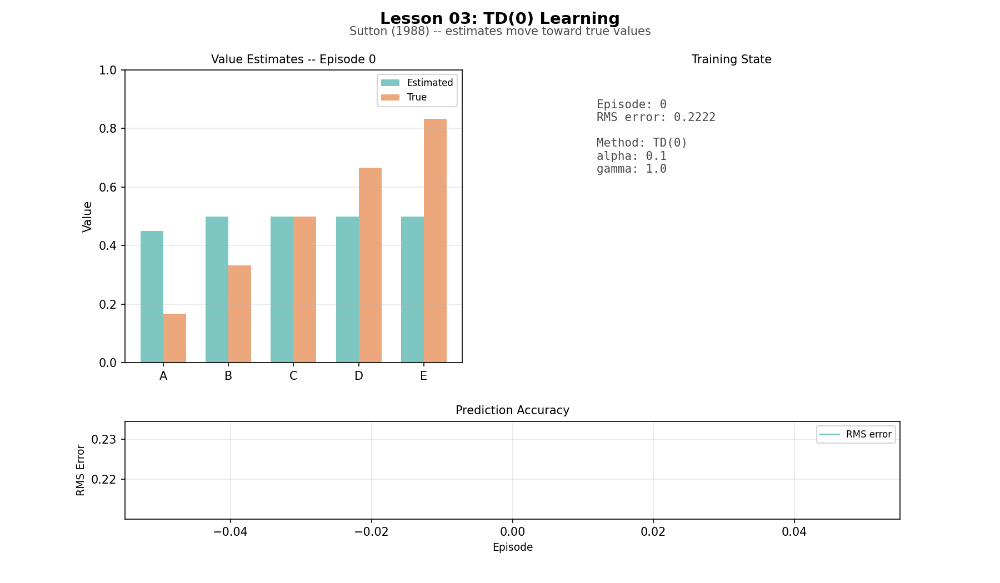
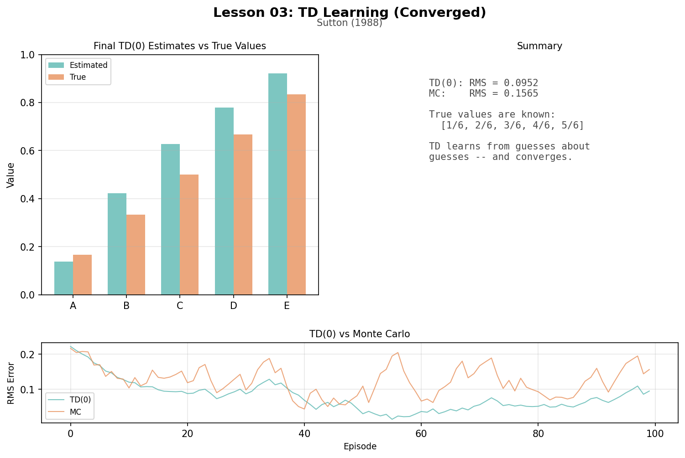
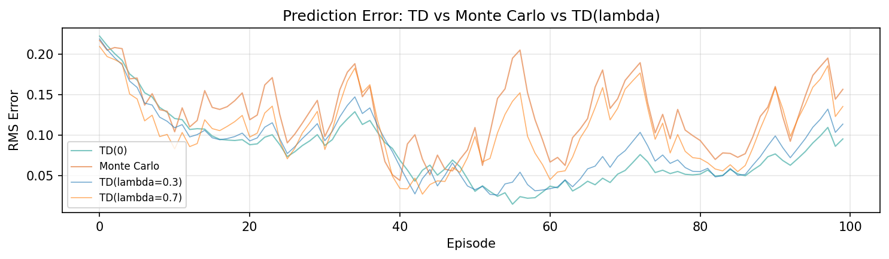

# Lesson 3: Temporal-Difference Learning (Sutton, 1988)

In 1988, Richard Sutton formalized the idea that drove Lesson 02's critic: you can learn to predict without waiting for the final outcome. This lesson isolates TD learning on a simple random walk where the true values are known.

```
uv run python lessons/03_td_learning.py
```

## The Random Walk

Five states in a chain. The agent starts at C and walks left or right at random (50/50).

```
[0] <-- A -- B -- C -- D -- E --> [+1]
 |                                  |
 lose (reward 0)        win (reward +1)
```

True values (probability of reaching +1 from each state):

```
A: 1/6 = 0.167    B: 2/6 = 0.333    C: 3/6 = 0.500
D: 4/6 = 0.667    E: 5/6 = 0.833
```

Why these values? From C, you go left or right with equal probability, so the chance of eventually reaching +1 is exactly 0.5. Each step closer to +1 adds 1/6.

## TD(0): Bootstrapping

TD(0) updates V(s) after every single step:

```
V(s) += alpha * [reward + gamma * V(s') - V(s)]
```

Concrete walkthrough (all values start at 0.5, alpha=0.1, gamma=1.0):

```
Walk: C -> D -> E -> [+1]

Step 1: C -> D, reward=0.  TD error = 0 + 0.5 - 0.5 = 0.   V(C) unchanged.
Step 2: D -> E, reward=0.  TD error = 0 + 0.5 - 0.5 = 0.   V(D) unchanged.
Step 3: E -> [+1], reward=1.  TD error = 1 - 0.5 = 0.5.  V(E) = 0.55.
```

Only E updated. Now watch the ripple on episode 2 (same walk C→D→E→[+1]):

```
Step 2: D -> E, reward=0
  TD error = 0 + 0.55 - 0.5 = 0.05  <-- SURPRISE! V(E) changed.
  V(D) += 0.1 * 0.05 = 0.005 -> V(D) = 0.505
```

The +1 reward rippled one step further back. Information propagates backward one step per episode — the same "ripple" as Lesson 01, but learned from experience.

## Monte Carlo: Waiting for the Truth

MC waits for the episode to end, then updates each state toward the actual return G from its first visit:

```
Walk: C -> D -> E -> [+1] (gamma=1.0)
G from C = 0 + 0 + 1 = 1
G from D = 0 + 1 = 1
G from E = 1

V(C) += 0.1 * (1 - 0.5) = 0.05 -> 0.55
V(D) += 0.1 * (1 - 0.5) = 0.05 -> 0.55
V(E) += 0.1 * (1 - 0.5) = 0.05 -> 0.55
```

MC waits for the outcome, then updates the first visit of each state at once. Unbiased but high-variance — the next episode from C might give G=0 instead of G=1, making V(C) bounce between targets.

## Training Results

```
Final value estimates vs true values:
  State    True   TD(0)      MC
  -----    ----   -----      --
      A   0.167   0.138   0.191
      B   0.333   0.422   0.549
      C   0.500   0.627   0.706
      D   0.667   0.780   0.786
      E   0.833   0.921   0.971

Final RMS:  TD(0) = 0.0952   MC = 0.1565
```

Both converge toward true values. TD(0) typically reaches low error faster because it reuses information across steps.

## TD(lambda): The Spectrum

Lambda blends TD(0) and Monte Carlo via eligibility traces:

```
lambda = 0.0 : traces decay instantly, only current state gets credit
lambda = 0.3 : mostly TD, some backward credit
lambda = 0.7 : mostly MC, traces spread credit further back
lambda = 1.0 : most MC-like (not exactly identical due to online traces)
```

With lambda=0.5 on the walk C→D→E→[+1], when E→[+1] produces TD error 0.5:

```
E: trace=1.0   V(E) += 0.1 * 0.5 * 1.0  = 0.050
D: trace=0.5   V(D) += 0.1 * 0.5 * 0.5  = 0.025
C: trace=0.25  V(C) += 0.1 * 0.5 * 0.25 = 0.0125
```

The reward spreads backward in one episode instead of taking three. Lambda > 0 helps most when episodes are long or the environment is large.

## Artifacts

### Value Estimates Animation



Teal bars (estimated) converge toward orange bars (true values) over episodes. RMS error decreases in the bottom pane.

### Final Estimates vs True Values



### TD vs MC vs TD(lambda) Comparison



## Next

TD learning predicts values by bootstrapping from the next state's estimate. But prediction is only half the problem. In Lesson 04, Watkins extends TD to control: learning which actions to take, not just how good states are. That is Q-learning.
