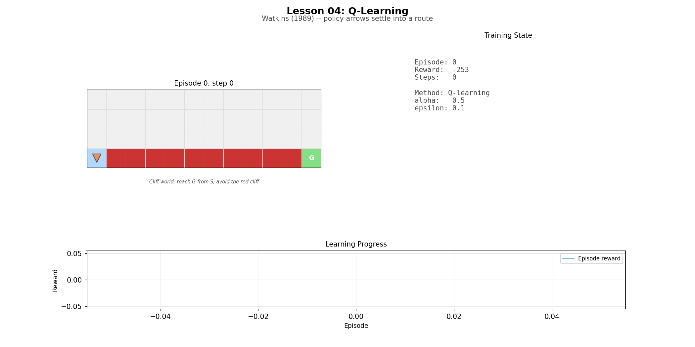
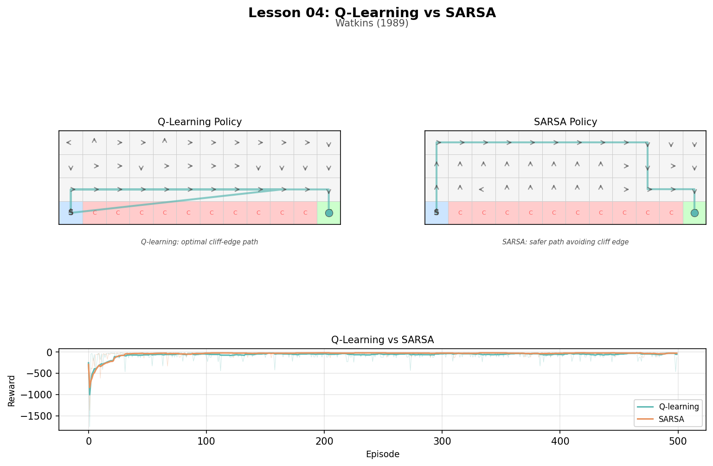
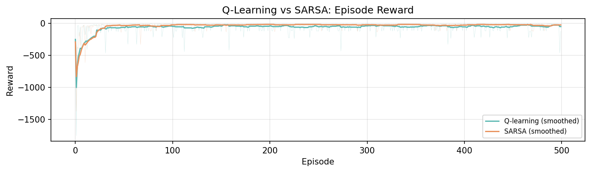

# Lesson 4: Q-Learning (Watkins, 1989)

In 1989, Chris Watkins showed how an agent could learn the optimal policy while exploring — without needing a model and without being constrained to follow its current best guess. This extends TD learning from prediction (Lesson 03) to control.

```
uv run python lessons/04_q_learning.py
```

## The Cliff World

A 4x12 grid. Start at bottom-left, goal at bottom-right. The cliff runs along the bottom edge.

```
. . . . . . . . . . . .
. . . . . . . . . . . .
. . . . . . . . . . . .
S C C C C C C C C C C G    S=start, C=cliff(-100), G=goal
```

Normal steps cost -1. Stepping on the cliff costs -100 and teleports back to start. The optimal path is along the cliff edge (13 steps, reward -13).

## Q-Learning: Off-Policy Control

```
Q(s, a) += alpha * [r + gamma * max_a' Q(s', a') - Q(s, a)]
```

The "max" makes this off-policy: the update assumes the agent will act optimally from s' onward, even while it explores with epsilon-greedy.

## SARSA: On-Policy Alternative

```
Q(s, a) += alpha * [r + gamma * Q(s', a_next) - Q(s, a)]
```

SARSA uses the action ACTUALLY taken next. Near the cliff, a random action might step off the edge. SARSA accounts for this risk; Q-learning ignores it.

## Training Results

```
Average reward per 50 episodes:
  Episodes   0- 49:  Q-learning  -117.2   SARSA  -108.2
  Episodes 100-149:  Q-learning   -56.1   SARSA   -24.5
  Episodes 450-499:  Q-learning   -43.6   SARSA   -27.7
```

Q-learning's path hugs the cliff edge (optimal but risky during training). SARSA's path stays higher (safer during exploration). Both are "correct" in different senses.

## Artifacts

### Q-Learning Trajectories



Early episodes show the agent wandering and falling off the cliff. Later episodes show a direct path along the bottom row.

### Q-Learning vs SARSA Policies



### Reward Comparison



SARSA achieves better average reward during training (fewer cliff falls) but Q-learning learns the truly optimal path.

## Next

Q-learning uses tables: one entry per state-action pair. But what if the state space is too large to tabulate — like pixel observations? In Lesson 05, DQN replaces the table with a neural network: Q-learning at scale.
