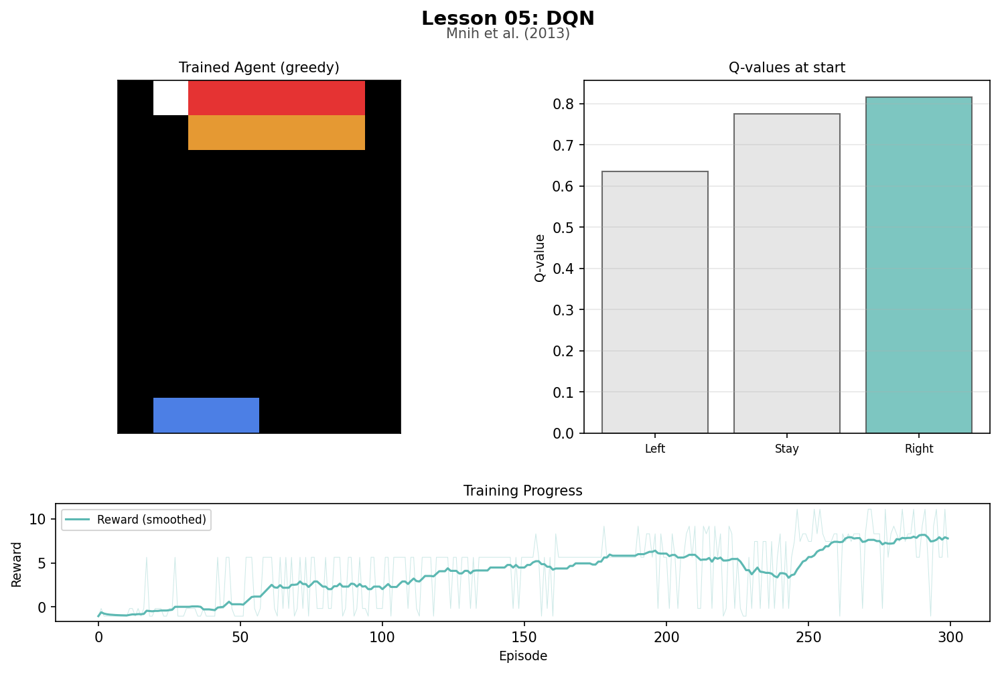
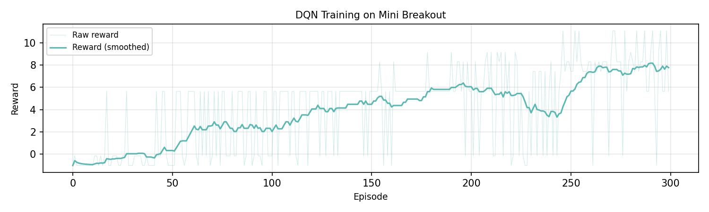

# Lesson 5: Deep Q-Network (Mnih et al., 2013)

In 2013, DeepMind showed that a neural network could learn to play Atari games from raw pixels using Q-learning. This extends Lesson 04's tabular Q-learning to function approximation: the table is replaced by a network that generalizes across states.

```
uv run python lessons/05_dqn.py
```

## When Tables Fail

Q-learning (Lesson 04) stored one value per state-action pair. The cliff world had 48 states and 4 actions: 192 entries. That worked because the agent visited each state many times.

Breakout's 8x10 pixel grid is different. Each frame is effectively unique. The agent will almost never see the exact same pixel arrangement twice. A table with no entry for this frame has nothing to say about it. The state space is astronomically larger than any table could cover.

The solution is function approximation: a neural network that takes pixel values as input and outputs Q-values for every action. It generalizes because it learns patterns, not individual entries. Two frames with the ball one pixel apart produce similar Q-values, even if neither has been seen before.

## Mini Breakout

```
row 0: . B B B B B B .
row 1: . B B B B B B .
row 2: . . . . . . . .
row 3: . . . . o . . .   ball starts here, moving down-right
row 4-8: empty
row 9: . . . = = = . .   paddle, width 3
```

The agent sees 82 input values: 80 pixel floats (0.0=empty, 0.5=brick, 0.7=ball, 1.0=paddle) plus 2 ball velocity components (vertical and horizontal direction). The velocity is necessary because a single frame is ambiguous: the same pixel layout can occur with the ball moving up or down, and the correct action differs. Without velocity, the observation is not Markov.

Actions: left(0), stay(1), right(2). Hitting a brick gives +1.0, missing the ball gives -1.0, each step costs -0.01.

## The Neural Network as a Q-Table

In Lesson 04, looking up a Q-value meant indexing into a dict:

```
Table lookup:    Q[(state_label, action)] -> float
```

DQN replaces the dict with a forward pass:

```
Network forward: network(pixels + velocity) -> [Q(s, left), Q(s, stay), Q(s, right)]
```

The update rule is the same TD error from Lesson 04, applied to network weights instead of table entries:

```
target = reward + gamma * max_a' Q_target(s', a')
loss   = huber(Q_online(s, a), target)
```

Instead of updating one table entry, a single training step adjusts all weights, changing Q-values for every state at once.

Architecture: 82 inputs -> 32 hidden (ReLU) -> 3 outputs.

## Three Ideas That Make It Work

1. **Experience replay**: store transitions in a circular buffer, train on random mini-batches. This breaks temporal correlation (consecutive frames are nearly identical) that would otherwise make training unstable.

2. **Target network**: a frozen copy of the online network, updated every N episodes. Without this, every gradient step shifts the target. The target network holds still long enough for the online network to converge.

3. **Epsilon decay**: start with epsilon=1.0 (pure random) and linearly decrease to 0.1. Early randomness fills the replay buffer with diverse experience. Later, the agent exploits what it has learned.

## Training Results

```
Training 300 episodes
Network: 82 -> 32 (relu) -> 3 (identity)
Batch size: 16, train every 2 steps
Replay buffer: 3000 capacity, min 100
Target network updated every 20 episodes
Epsilon: 1.0 -> 0.1 over 200 episodes
Learning rate: 0.01, gamma: 0.95

Average reward per 50 episodes:
  Episodes   0- 49:  reward  -0.07  epsilon 0.89  steps 15
  Episodes  50- 99:  reward   2.34  epsilon 0.66  steps 29
  Episodes 100-149:  reward   4.19  epsilon 0.44  steps 37
  Episodes 150-199:  reward   5.60  epsilon 0.21  steps 48
  Episodes 200-249:  reward   4.86  epsilon 0.10  steps 51
  Episodes 250-299:  reward   7.68  epsilon 0.10  steps 72
```

Early episodes end in 6 steps (immediate miss, reward -1.05). By episode 50, the agent survives long enough to hit bricks. By episode 250, it averages 72 steps and +7.68 reward per episode.

```
Early episodes:
  Episode   0:  reward   -1.05  steps   6  epsilon 1.00
  Episode   1:  reward   -0.18  steps  20  epsilon 1.00
  Episode   2:  reward   -1.05  steps   6  epsilon 0.99
  Episode   3:  reward   -1.05  steps   6  epsilon 0.99
```

## What the Network Learned

With exploration off (epsilon=0), the trained network plays greedily:

```
Greedy evaluation (no exploration):
  Reward:     9.18
  Steps:      94
  Bricks hit: 11/12
  Remaining:  1

Q-values at start position:
  Left : 0.6356
  Stay : 0.7756
  Right: 0.8166 <-- best
```

The network destroyed 11 of 12 bricks in 94 steps, earning a reward of 9.18. Compare this to the random policy, which missed the ball within 6 steps and scored nothing.

The Q-values at the start position show the network has learned that moving right is slightly better than staying or moving left, because the ball starts moving down-right and the paddle needs to track it.

The network does not understand Breakout. It has no concept of ball trajectory or paddle interception. It has a function from 82 numbers to 3 numbers, shaped by thousands of gradient updates, that happens to produce useful behavior. That is function approximation: not understanding, but interpolation that works.

## Artifacts

### Training Animation


Three phases: random policy (ball sails past), training curve (reward climbing), and trained policy (the agent rallies and destroys bricks). The trained policy replay loops twice.

### Trained Agent Snapshot



A frame from the greedy rollout, Q-values at the start position, and the full training reward curve.

### Reward Curve



Raw episode rewards (light) and smoothed rewards (dark). The agent transitions from immediate failure (reward near -1) to sustained play (reward near +8) as epsilon decays and the network improves.

## Next

DQN learns values and derives a policy indirectly: pick the action with the highest Q-value. That works when actions are discrete (left, stay, right). But what about continuous actions, like applying 0.73 units of force? There is no finite set of actions to take the max over. In Lesson 06, Proximal Policy Optimization (PPO) learns the policy directly: the network outputs a probability distribution over actions.
