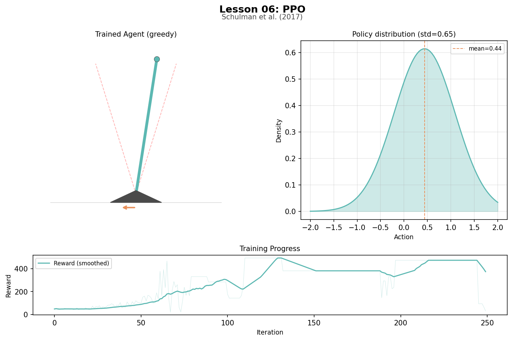
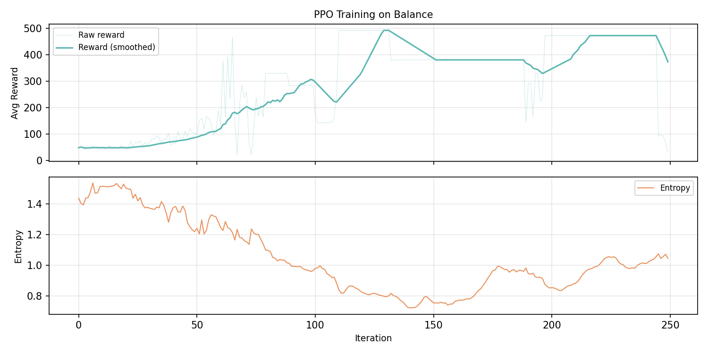

# Lesson 6: Proximal Policy Optimization (Schulman et al., 2017)

PPO learns the policy directly instead of deriving it from Q-values. The actor network outputs a Gaussian distribution over continuous actions, and the agent samples from it. A clipped surrogate objective prevents catastrophically large updates.

```
uv run python lessons/06_ppo.py
```

## The Big Shift

Every lesson so far has followed the same pattern: learn a value, use the value to pick actions. Bellman computed V(s). TD learning estimated V(s). Q-learning estimated Q(s, a). DQN approximated Q(s, a) with a neural network. In every case, the agent asked "how good is this state or action?" and picked the highest value.

That pattern ends here. PPO does not learn values and derive a policy from them. It learns the policy directly. The neural network IS the policy.

```
DQN:  network(state) -> [Q(left), Q(stay), Q(right)]  -> pick highest
PPO:  network(state) -> (mean=0.3, std=0.6)           -> sample 0.47
```

DQN's network outputs three numbers and the agent picks the biggest. PPO's network outputs a bell curve and the agent draws a random number from it. You cannot take argmax over an infinite range, but you can sample from a bell curve centered anywhere.

## Revisiting Balance

Lesson 02 solved the inverted pendulum with Barto, Sutton, and Anderson's 1983 ACE/ASE: 2 discrete actions, 36 boxes, eligibility traces. PPO uses the raw angle and velocity directly, applies continuous torque, and learns through neural policy gradients.

```
State:   (angle, angular velocity)—two continuous numbers
Action:  torque in [-1, +1]—any value, not just left/right
Reward:  +1 per step survived, 0 when the pole falls
Goal:    survive 500 steps
```

Same environment, same goal, but 34 years of algorithmic progress.

## The Simplest Policy Gradient

The core idea fits in one sentence: if an action turned out better than expected, adjust the network to make that action more likely next time. If it turned out worse than expected, make it less likely.

The intuition: the pole is tilting right. The network outputs a bell curve centered at torque=0.1. The agent samples torque=-0.3. Over the next several steps, the pole recovers and the agent survives longer than the critic predicted. That produces a positive advantage for torque=-0.3. The update: shift the bell curve so that torque becomes more probable. (The mechanism—advantages, the critic, how "better than expected" is computed—comes later.)

Compare this to DQN's update. DQN asked "what is this action worth?" and updated a value toward a target. PPO asks "should I do this action more or less often?" and adjusts a probability. There is no target in the DQN sense—there is only the direction: more likely or less likely.

## The Policy as a Bell Curve

The bell curve is a Gaussian distribution, defined by two numbers: the mean (where centered) and the standard deviation (how wide).

```
Actor:  state -> [mean, log_std]
Policy: sample action from Gaussian(mean, exp(log_std))
```

The output is log_std rather than std directly because the log can be any real number, while std must be positive. Taking exp() of the output guarantees a valid standard deviation.

A wide bell curve means the agent is uncertain—it explores. A narrow bell curve means it is confident—it applies nearly the same torque every time. Training makes the curve narrower and shifts it toward the right torque.

## Why Clipping

The policy gradient has a problem: if one good action makes the network wildly more likely to repeat it, the policy can collapse. PPO's solution is the clipped surrogate. After each batch, compute a ratio for each action—how much more likely is this action under the new policy vs the old?

```
ratio = new_probability / old_probability
L = min(ratio * A, clip(ratio, 1-eps, 1+eps) * A)
```

Concrete example: the agent applied torque 0.3 when tilting right (advantage=+2.0). After one gradient step, the ratio pushes toward 1.5. But with epsilon=0.2, the clip caps it at 1.2. Beyond that point, the gradient is zero. The new policy stays close to the old one—that is the "proximal" in PPO.

## The Critic and Advantages

The policy gradient says "make good actions more likely." But how does the agent know which actions were good? Using raw rewards would make every action in a good episode look good. The advantage solves this: how much better was this action than what was expected?

A separate network—the critic—estimates the expected value of each state. Advantage = what happened - what was expected. This is the same actor-critic split from Lesson 02 (ACE was the critic, ASE was the actor), now with neural networks.

GAE (Generalized Advantage Estimation) computes advantages using the same TD-vs-MC tradeoff from Lesson 03:

```
delta_t = r_t + gamma * V(s_{t+1}) - V(s_t)
A_t = delta_t + (gamma * lambda) * delta_{t+1} + ...
```

With lambda=0.95, a lucky step is partially offset by what follows, reducing variance.

## Training Results

```
Actor:  2 inputs -> 64 hidden (tanh) -> 2 outputs (mean, log_std)
Critic: 2 inputs -> 64 hidden (tanh) -> 1 output (value)

Iterations:     250
Steps/iter:     500
Epochs:         3
Gamma:          0.99
Lambda (GAE):   0.95
Clip epsilon:   0.2
Actor LR:       0.001
Critic LR:      0.003

Average per 30 iterations:
  Iterations   0- 29:  reward    52.7  std 1.058  entropy 1.470
  Iterations  30- 59:  reward   104.3  std 0.910  entropy 1.317
  Iterations  60- 89:  reward   249.8  std 0.765  entropy 1.145
  Iterations  90-119:  reward   311.9  std 0.612  entropy 0.926
  Iterations 120-149:  reward   425.8  std 0.530  entropy 0.783
  Iterations 150-179:  reward   381.0  std 0.556  entropy 0.827
  Iterations 180-209:  reward   386.4  std 0.603  entropy 0.911
  Iterations 210-239:  reward   473.0  std 0.655  entropy 0.994
```

The reward climbs from ~53 to 473, with a dip at iterations 150-209 before recovering. The std drops from ~1.06 to ~0.53 by iteration 150, then increases slightly as the agent explores refinements.

The dip is a common PPO pattern. The agent reaches near-optimal performance (~426), then the policy std narrows enough that advantages become noisier. The recovery to 473 shows the critic catching up. Without the clip, this dip would be a collapse.

The hidden activation is tanh instead of DQN's ReLU. Tanh's bounded output (-1 to +1) prevents activation explosion when inputs are continuous and potentially large.

## What the Network Learned

With the deterministic policy (using the clamped mean, no sampling):

```
Greedy evaluation:
  Steps survived:  500
  Total reward:    500
  Max |angle|:     0.1620 rad
  Avg |torque|:    0.2928

Policy at representative states:
  upright, still          torque=+0.438  std=0.649
  tilting right           torque=-0.028  std=0.664
  tilting left            torque=+0.903  std=0.635
  rotating right          torque=-0.831  std=0.849
```

The agent survived 500 steps, keeping the pole within 0.16 radians of vertical. Tilting left produces strong positive torque, rotating right produces strong negative torque, and the "upright, still" bias (+0.438) reflects the pole's initial rightward tilt of 0.01 radians—the network learned to pre-compensate.

Compare this to L02's binary push-left/push-right: PPO applies smooth, proportional corrections.

## Artifacts

### Training Animation


Three phases: random policy (pole falls immediately), training progression (bell curve narrowing), trained policy (pole stays balanced for 500 steps).

### Trained Agent Snapshot



The trained pole nearly vertical, the narrow policy Gaussian, and the full training reward curve.

### Reward and Entropy Curves



Top: average reward climbing from ~50 to 400+. Bottom: policy entropy declining as the agent commits to a strategy, with recovery visible around iteration 200.

## Next

PPO learns from real experience only. Every training step requires actually running the environment. In Lesson 07, DreamerV3 learns a model of the environment and trains the policy in imagination—real data trains the world model, imagined data trains the policy.
