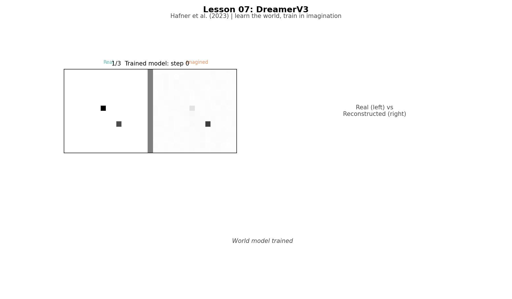
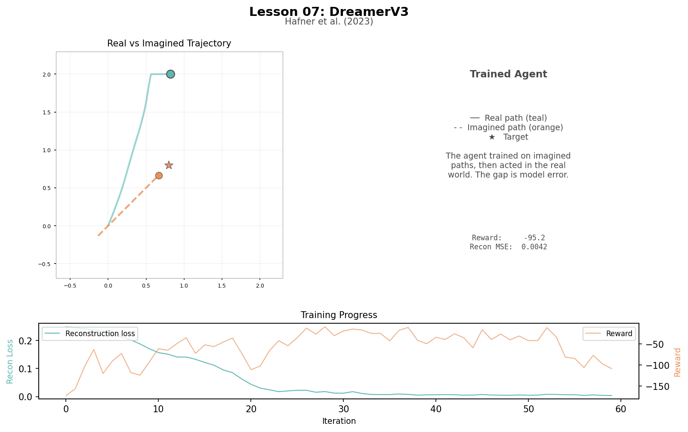
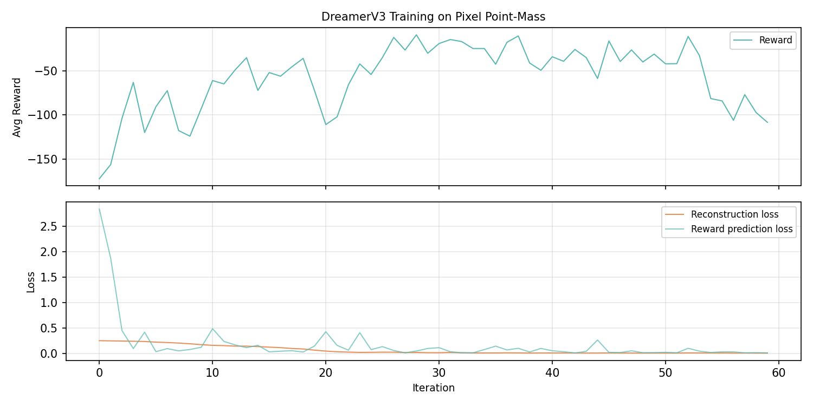

# Lesson 7: Dreamer-style World Model (Hafner et al., 2023)

Dreamer learns a model of the world from pixel observations, imagines trajectories in latent space, and trains the policy on imagined data. Real data trains the world model; imagined data trains the policy.

```
uv run python lessons/07_dreamer.py
```

## The Imagination Insight

Every algorithm so far learned from real experience. Dreamer asks: what if the agent could practice in its head? Instead of learning values or a policy from real transitions, Dreamer learns a model of the world itself—what happens next given a state and action—then imagines thousands of trajectories without touching the real environment. This matters because real steps are expensive (physics, rendering, risk); a world model turns one real episode into many training episodes.

```
L01-L05:  learn values, derive actions
L06:      learn the policy directly
L07:      learn the world, train in imagination
```

## The Pixel World

A 16x16 pixel grid. The white dot is the agent, the gray dot is the target, the background is black. The agent applies a 2D force to move toward the target—think of pushing a marble across a table. The physics is a "point-mass" (position and velocity, no shape). The agent sees 256 pixel values, not coordinates.

```
Observation: 16x16 = 256 pixel values
Action:      [force_x, force_y] in [-1, +1]
Reward:      negative distance to target
```

## The World Model

Four components:

- **Encoder:** 256 pixels → 32 latent numbers (compress what matters)
- **GRU dynamics:** (latent state, action) → next latent state (learned physics)
- **Decoder:** 32 latent → 256 pixels (training signal for encoder)
- **Reward head:** 32 latent → 1 reward (training signal for dynamics)

All dense networks. The real DreamerV3 uses convolutional encoders. For a 16x16 grid with two single-pixel markers, dense layers are sufficient.

## Teacher Forcing

During training, the GRU sees the encoded real observation at each step (teacher forcing). During imagination, it runs open-loop—no observations to correct it. Early imagination steps track reality; later steps diverge as errors compound. This is the fundamental tradeoff of world models: imagination is free but imperfect.

## Training Results

```
Encoder:     256 -> 64 (tanh) -> 32 (tanh)
GRU:         input=2 (action), hidden=32
Decoder:     32 -> 64 (tanh) -> 256 (sigmoid)
Reward head: 32 -> 32 (tanh) -> 1 (identity)
Actor:       32 -> 32 (tanh) -> 4 (identity)
Critic:      32 -> 32 (tanh) -> 1 (identity)

Average per 15 iterations:
  Iterations   0- 14:  reward   -93.0  recon 0.1948  rew_loss 0.4791
  Iterations  15- 29:  reward   -49.8  recon 0.0472  rew_loss 0.1169
  Iterations  30- 44:  reward   -30.1  recon 0.0085  rew_loss 0.0706
  Iterations  45- 59:  reward   -55.5  recon 0.0061  rew_loss 0.0258
```

The reconstruction loss drops from 0.19 to 0.006—the world model learns pixel structure. Reward improves from -93 to -30, with some regression in the last window. Reward prediction loss drops from 0.48 to 0.03—the dynamics model tracks reward-relevant features.

The training is noisier than PPO's because two systems are learning simultaneously: the world model and the policy. When the world model improves, the policy's imagined data changes underneath it. When the policy improves, it visits new states the world model hasn't seen. This co-adaptation is a fundamental challenge of model-based RL.

## What Dreamer Learned

```
Greedy evaluation:
  Steps:      100
  Reward:     -95.2
  Avg recon MSE: 0.0042
```

The world model learned to reconstruct pixel frames with MSE of 0.004, yet the greedy reward (-95.2) is close to a random policy despite training reaching -30. The main reason is a distribution shift: during imagination the actor trains on GRU hidden states (the dynamics model's predictions), but during evaluation it sees encoder outputs (compressions of real pixels). These are different distributions, and the mismatch erases the training gains. The full DreamerV3 solves this with the RSSM, which combines the GRU prediction with the current observation at each step to produce a consistent latent state for both training and inference.

Three further simplifications compound the problem: (1) teacher forcing—the GRU never practices open-loop prediction, so imagined trajectories drift; (2) no uncertainty—the full DreamerV3 uses the gap between prediction and observation to measure trust, while our deterministic GRU commits fully to one estimate; (3) minimal training budget—60 iterations is enough to learn pixel structure but not enough for the actor-critic to converge.

This is a simplified version of DreamerV3. The full paper uses a stochastic RSSM with prior/posterior distributions, KL regularization, symlog predictions, and twohot value distributions. We kept the core idea—learn what happens next, then practice in imagination—and used dense networks with teacher forcing and MSE losses.

## Artifacts

### Training Animation



Three phases: (1) random trajectory before training, (2) training progression with reconstruction loss dropping, (3) real vs imagined trajectory comparison showing where the world model's predictions diverge from reality.

### Trained Agent



Left: real (teal) vs imagined (orange dashed) trajectory. Right: real pixel frame beside the world model's reconstruction, showing the encoder learned to preserve agent and target positions. Bottom: training progress curves.

### Loss Curves



Top: average reward improving over training. Bottom: reconstruction loss (orange) and reward prediction loss (teal) both declining as the world model learns.

## Series Complete

```
L01 (Bellman, 1957)     → Planning with a known model
L02 (Barto/Sutton, 1983) → Learning from experience
L03 (Sutton, 1988)       → Bootstrapping from predictions
L04 (Watkins, 1989)      → Off-policy control
L05 (Mnih, 2013)         → Neural function approximation
L06 (Schulman, 2017)     → Policy gradients
L07 (Hafner, 2023)       → World models and imagination
```

66 years of asking the same question in different ways: given what I know, what should I do next?
